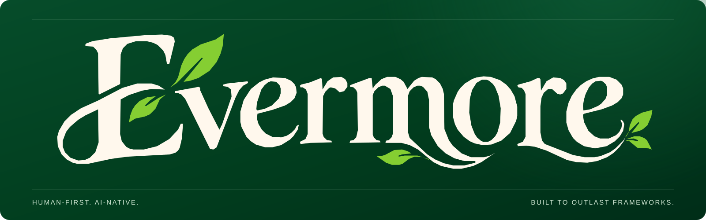

# Evermore / Visual identity

The identity is based on the **approved supplied Evermore logo**. The letterforms and leaves were traced from that artwork for clean, reusable repository vectors; they are not a replacement typeface. This documentation describes the visual system used in this repository, not a claim of registered trademark status.

## Core assets

| Asset | Use |
| --- | --- |
| [Brand banner](evermore-banner.svg) | GitHub README and hero treatments on evergreen |
| [Wordmark](evermore-wordmark.svg) | Transparent custom ivory lettering + botanical leaves on a dark background |
| [Botanical E icon](evermore-icon.svg) | Compact avatar, favicon and small product spaces, derived from the initial letter |
 
**Never retype the wordmark, stretch it, detach its leaves or change its proportions.** Keep the logo on a dark enough canvas to preserve both ivory and green contrast.

## Repository color tokens

The following palette is sampled and harmonized from the approved logo. Treat it as the project's source of truth for new visual implementations.

| Name | Hex | Application |
| --- | --- | --- |
| Forest / brand | `#013D1E` | Principal canvas and primary brand color |
| Deep forest | `#002D18` | Navigation and dark surfaces |
| Forest raised | `#07522E` | Interactive raised surfaces |
| Leaf green | `#85CE32` | Botanical accent, focused and selected states |
| Ivory | `#FFF8ED` | Wordmark, headings and core text |
| Sage | `#B7D6BD` | Secondary text and quiet UI |
| Border | `#275A3B` | Quiet outlines on dark backgrounds |

Use the leaf color as an **accent**, not as every panel's background. Make diagrams and code snippets legible without relying only on color. Ensure text and UI states remain distinguishable for low-vision users.

## Clear space and scale

Reserve clear space of approximately the height of the capital E's upper serif around the full wordmark. Use the complete wordmark for wide areas; use the separate E icon for square formats. A minimum recommended wordmark width on screen is 180 px. Avoid placing the transparent wordmark directly on white.

## Product language

- Editorial, deliberate, quietly expressive: forest-green foundations with the wordmark as the visual signature.
- Ivory text and restrained lime highlights; avoid unrelated blue/purple/neon branding.
- Readable monospace for code samples, and clear differentiation between source, preview and actual compiler output.
- Keep the existing **pre-alpha** status and **proprietary / UNLICENSED** licensing notice visible. Brand presentation must not exaggerate runtime or compiler maturity.

## Where these assets appear

- [English README](../README.md) and [Spanish README](../README.es.md)
- [Studio research prototype](../studio/index.html)
- [Playground research prototype](../playground/index.html)

To update the identity, change the assets and document the new color tokens here, then keep README, Studio and Playground synchronized.
